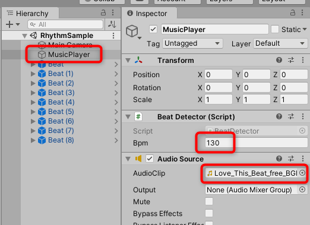

# BeatDetector
[こちら](https://am1tanaka.hatenablog.com/entry/beat-calc/)のブログで解説しているビート計算のサンプルプロジェクトです。

## 環境
- Unity2019.3.15
- Windows10

## 設定
Unityでプロジェクトを実行する手順です。

- このリポジトリーをクローンするか、DownloadZIPして入手して、Unityで開きます
- ProjectウィンドウのBeatDetectorフォルダー内のScenesフォルダーを開き、RhythmSampleシーンをダブルクリックして開きます
- 音源データが含まれていないので、実行する前に設定してください。サンプルでは
[d-elf.com](https://www.d-elf.com/)から「Love This Beat / Free BGM ver.1」を利用しました。お好きな曲をUnityプロジェクトに含めてください
- BPMが分からない場合は、おとわびさんの[BPMタップテンポはかるくん](https://otowabi.com/develop/20180324bpm-taptempo)のページで計ることができます
- 音データをProjectに加えたら、HierarchyウィンドウでMusicPlayerオブジェクトを選択して、以下の2点を設定ます
  - Beat DetectorスクリプトのBpm設定に設定した曲のBPMを設定します
  - Audio SourceのAudioClip欄に、鳴らしたい曲をドラッグ&ドロップして設定します

以上で設定完了です。Playすると、四角がリズムにあわせて動きます。

## スクリプト
`BeatDetector/Scripts`フォルダーにまとめてあります。

- `BeatDetector.cs`
  - 曲を鳴らすAudioSourceをアタッチしてあるオブジェクトに一緒にアタッチします
  - 設定されたBPMを元に必要な情報を計算、提供をします
  - シングルトンとしての制御は省略しています。同時に複数あると誤動作します
- `BeatScaler.cs`
  - リズムにあわせてスケールアニメをさせたいオブジェクトにアタッチします
  - BeatDetectorを参照します

## ライセンス
- [MIT License](./LICENSE.txt)

Copyright (C) 2020 YuTanaka
